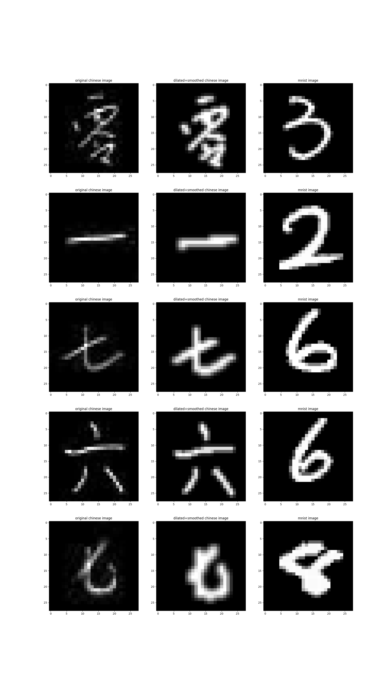

# Handwritten Languages Machine Learning Project

In this project, we explore the flexibility of five pipelines on the classification of handwritten characters across digits of different languages, in particular Arabic and Chinese numerals. The pipelines are:
1. Handcrafted feature extraction + SVM
2. Handcrafted feature extraction + Gradient Boosting
3. Handcrafted feature extraction + SVM
4. Handcrafted feature extraction + Gradient Boosting
5. Convolutional Neural Network

All pipelines were trained and tested on the combined dataset (both languages, within one training dataset), while the accuracy per language is also collected. 

All methods present higher accuracies on the classification of Chinese numerals than Arabic, with the most dissimilarity when using handcrafted features (margins up to 22%); demonstrating that the patterns in some languages are easier to learn for the aforementioned machine learning methods. The use of handcrafted features derives lower classification accuracies than PCA on both classifiers, showing especially sub-optimal results with SVM (accuracy up to 54.25%). However, SVM with PCA shows better results than the Gradient Boosting classifier, with a global accuracy of 98.15% versus 95.60% of the latter. The best result is obtained in the three scenarios by the CNN, with a global accuracy of up to 99.22%.


---
## Instructions


<details>
<summary>Preparation</summary>
<br>
To run the code you need to install the requirements:

```pip install -r requirements.txt```

and download the datasets from the links below, placing them into the ``Data`` folder.

- (Arabic) MNIST data from https://www.kaggle.com/datasets/oddrationale/mnist-in-csv?select=mnist_train.csv. This is a processed version of http://yann.lecun.com/exdb/mnist/.
- CHINESE numbers from Nazarpour, K; Chen, M (2017): Handwritten Chinese Numbers. Newcastle University. Dataset. https://www.kaggle.com/datasets/fedesoriano/chinese-mnist-digit-recognizer.

The contents of the ``preprocessing notebook`` selects a random sample of letters from each dataset; ensuring a balanced training and texting dataset. This notebook also performs morphological operations on the Chinese characters dataset, such that their visual characteristics match that of the MNIST dataset, as shown here:


</details>


---


The ``model_comparison.ipynb`` notebook is responsible for comparing the models on the testing set and generating the confusion matrices.


