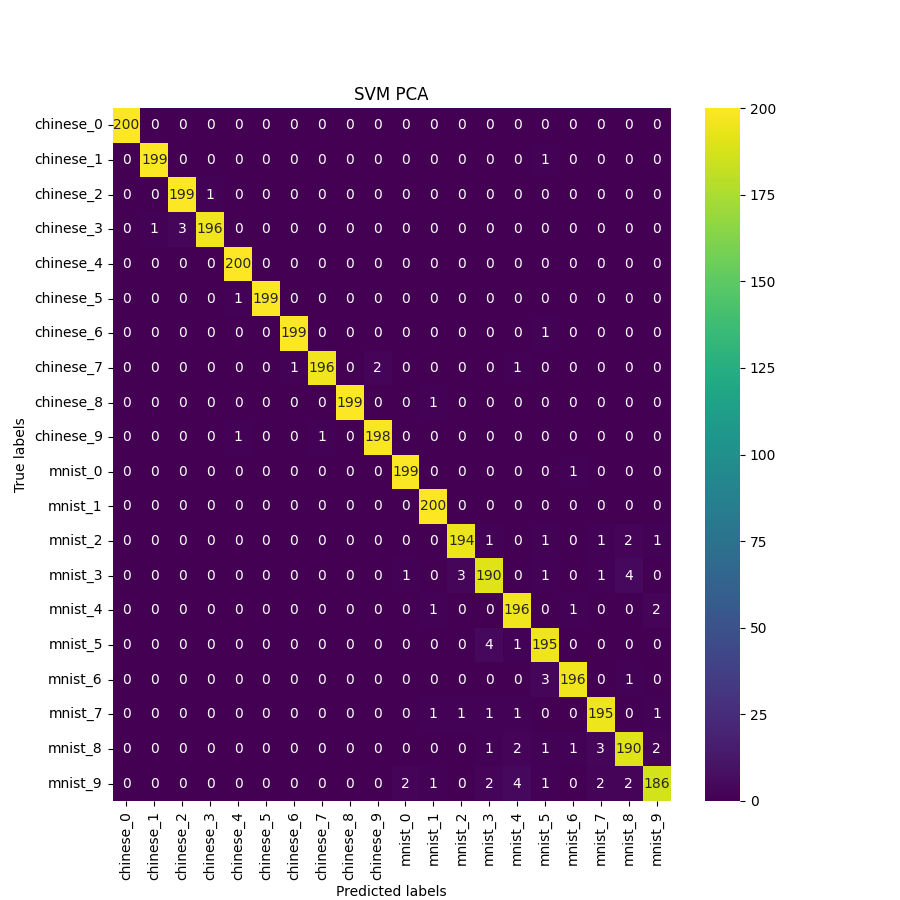
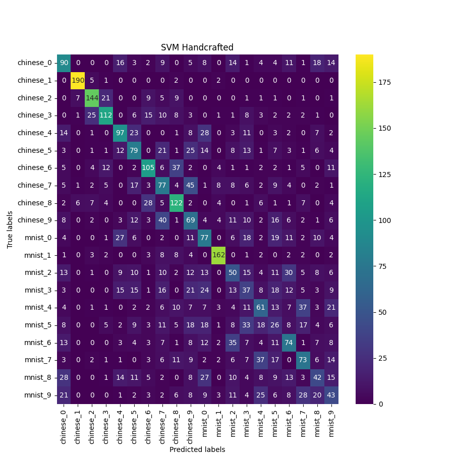
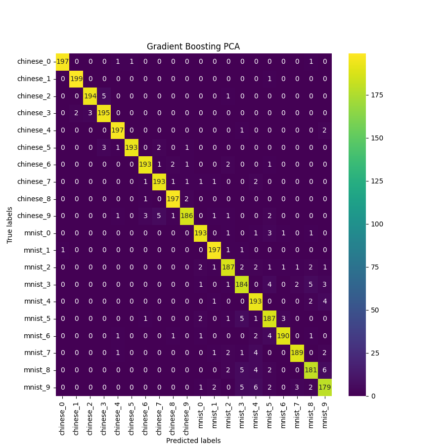
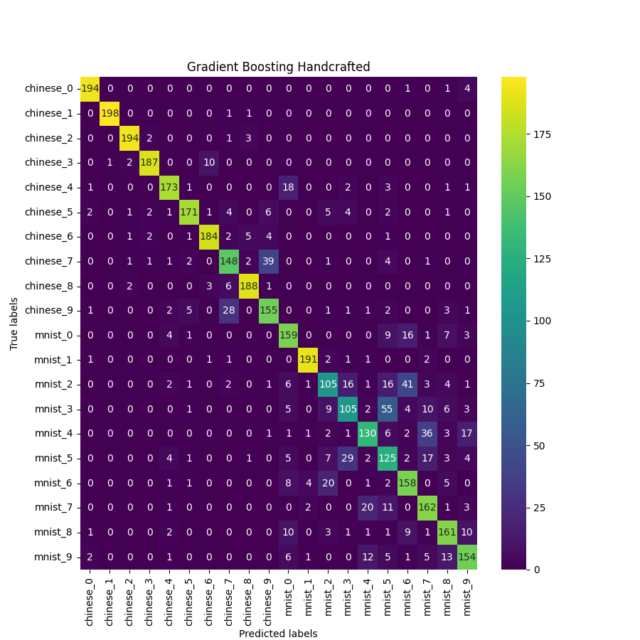
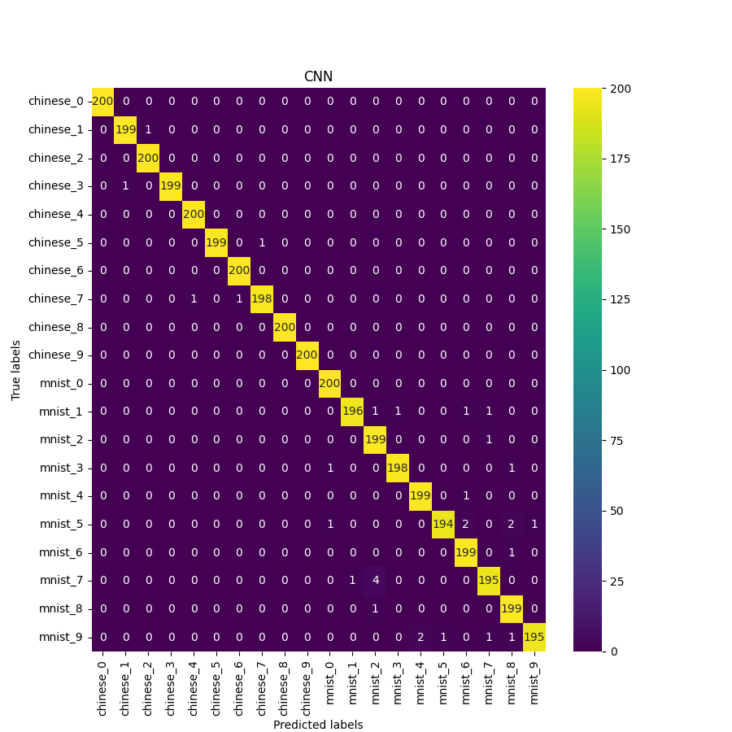

# Handwritten Languages Machine Learning Project

In this project, we explore the flexibility of five pipelines on the classification of handwritten characters across digits of different languages, in particular Arabic and Chinese numerals. The pipelines are:
1. Handcrafted feature extraction + SVM
2. Handcrafted feature extraction + Gradient Boosting
3. Handcrafted feature extraction + SVM
4. Handcrafted feature extraction + Gradient Boosting
5. Convolutional Neural Network

All pipelines were trained and tested on the combined dataset (both languages, within one training dataset), while the accuracy per language is also collected. 

All methods present higher accuracies on the classification of Chinese numerals than Arabic, with the most dissimilarity when using handcrafted features (margins up to 22%); demonstrating that the patterns in some languages are easier to learn for the aforementioned machine learning methods. The use of handcrafted features derives lower classification accuracies than PCA on both classifiers, showing especially sub-optimal results with SVM (accuracy up to 54.25%). However, SVM with PCA shows better results than the Gradient Boosting classifier, with a global accuracy of 98.15% versus 95.60% of the latter. The best result is obtained in the three scenarios by the CNN, with a global accuracy of up to 99.22%.


## Instructions


<details>
<summary>Preparation & Datasets</summary>
<br>
To run the code you need to install the requirements:

```pip install -r requirements.txt```

and download the datasets from the links below, placing them into the ``Data`` folder.

- (Arabic) MNIST data from https://www.kaggle.com/datasets/oddrationale/mnist-in-csv?select=mnist_train.csv. This is a processed version of http://yann.lecun.com/exdb/mnist/.
- CHINESE numbers from Nazarpour, K; Chen, M (2017): Handwritten Chinese Numbers. Newcastle University. Dataset. https://www.kaggle.com/datasets/fedesoriano/chinese-mnist-digit-recognizer.

The contents of the ``src/dataLoading.py`` selects a random sample of letters from each dataset; ensuring a balanced training and texting dataset. This notebook also performs morphological operations on the Chinese characters dataset, such that their visual characteristics match that of the MNIST dataset, as shown below, and centers and resizes all images to 28-by-28 pixels.


</details>


<details>
<summary>Feature Extraction Methods</summary>
<br>

The CNN is trained on grayscale 28x28 images, while PCA is used to transform said image format down to 85 PCA components (the number of components that we find to explain 90% of the dataset's variance).

In the case of handcrafted feature methods, 10 techinques are used to reduce the dimensions of the dataset (down to 10-dimensions, from 784):
1. A mixture of Gaussians (MoG) model, using 10 Gaussians.
2. K-Means clustering, using 20 clusters
3. Laplacian edge detection
4. Mean Brightness
5. Number of countours in the image
6. Number of circles in the image
7. Height/width ratio of the handwritten digit
8. Brightness ratio (middle column vs. middle row of the image)
9. Number of white islands in the image (white regions completely surrounded by black pixels)
10. Number of black islands in the image (reverse of the previous)

</details>


<details>
<summary>Model Training</summary>
<br>

The optimal model parameters can be found by running the ``ml_random_search.py`` script (while also setting the prefered feature extraction method and classifier architecture). For optimising the CNN, the ``cnn_gridsearch.py`` script is used.

Our optimised CNN model can be trained using the ``cnn.ipynb`` notebook, which will also record the training and validation losses and accuracies throughout a cross-validation process. We utilise the TensorFlow library to train our CNNs.

The weights of all of our trained models are kept in the ``saved_models`` folder, which can be called upon in the evaluation step.
</details>


<details>
<summary>Evaluation</summary>
<br>

The ``model_comparison.ipynb`` notebook is responsible for comparing the models on the testing set and generating the confusion matrices. It loads the optimised models kept in the aforementioned ``saved_models`` folder.


</details>


## Results

The accuracies of each classification pipeline on 0-9 handwritten digits from both languages (overall), as well as for just the Arabic digits, and just the Chinese digits, are shown below.

| Algorithm | Accuracy Overall (%) | Accuracy MNIST (%) | Accuracy Chinese (%) |
| --- | --- | --- | --- |
| SVM with PCA | 98.15 | 97.05 | 99.25 |
| SVM with Handcrafted | 43.25 | 32.25 | 54.25 |
| GBDT with PCA | 95.60 | 94.00 | 97.20 |
| GBDT with Handcrafted | 81.05 | 72.50 | 89.60 | 
| CNN | **99.22** | **98.70** | **99.75** | 

We find that the accuracies of machine learning methods used to classify handwritten digits are subject to distinct patterns present in the handwritten structures of different languages. While the classifiers themselves, the SVM, Gradient Boosting and CNN, showed only a slight increase in classification accuracy on the Chinese digits over the Arabic digits provided by the MNIST dataset. This difference was constant throughout all five classification pipelines. We also conclude that tailoring the handcrafted features to specific patterns in the handwriting of different languages was a significant contributor to variations in classification accuracy between the two languages in our dataset. Thus, more ‘automated’ (deep) learning algorithms for feature extraction and classification may be better suited to learning to classify handwriting in problem spaces where multiple languages may be present.

### Confusion Matrices

<details>
<summary>SVM w. PCA</summary>
<br>


</details>

<details>
<summary>SVM w. Handcrafted Features</summary>
<br>


</details>


<details>
<summary>GBDT w. PCA</summary>
<br>


</details>

<details>
<summary>GDBT w. Handcrafted Features</summary>
<br>


</details>


<details>
<summary>CNN</summary>
<br>


</details>


